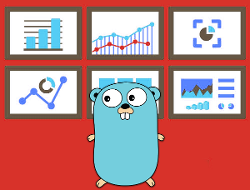

# vizigoto
[![GoDoc Widget]][GoDoc]
[![Semaphore Widget]][Semaphore]
[![Travis Widget]][Travis]
[![GoReport Widget]][GoReport]
[![License Widget]][License]

)](http://godoc.org/github.com/labstack

[GoDoc]: https://godoc.org/github.com/vizigoto/vizigoto
[GoDoc Widget]: http://img.shields.io/badge/go-documentation-blue.svg?style=flat-square
[Semaphore]: https://semaphoreci.com/tarcisio/vizigoto
[Semaphore Widget]: https://semaphoreci.com/api/v1/tarcisio/vizigoto/branches/master/badge.svg
[GoReport]: https://goreportcard.com/report/github.com/vizigoto/vizigoto
[GoReport Widget]: https://goreportcard.com/badge/github.com/vizigoto/vizigoto?style=flat-square
[Travis]: https://travis-ci.org/vizigoto/vizigoto
[Travis Widget]: https://travis-ci.org/vizigoto/vizigoto.svg?branch=master
[License]:https://raw.githubusercontent.com/vizigoto/vizigoto/master/LICENSE
[License Widget]:https://img.shields.io/badge/license-bsd--3-blue.svg?style=flat-square
